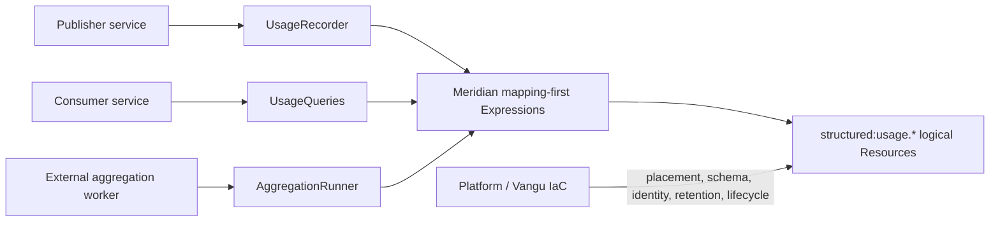

# Architecture

The Usage plugin is an in-process library over Meridian V1. Publisher and
consumer services remain separate external applications that may share this
package.

## Resource model

| Logical Resource | Record kind | Consistency | Typical placement capability |
| --- | --- | --- | --- |
| `structured:usage.meters` | Immutable meter versions | strong | conditional structured writes |
| `structured:usage.events` | Immutable facts/corrections | eventual | append/query, Usage profile |
| `structured:usage.aggregates` | Immutable aggregate versions | eventual | append/query, Usage profile |
| `structured:usage.batches` | Batch replay manifests | strong | conditional structured writes |
| `structured:usage.checkpoints` | Watermark CAS records | strong | conditional structured writes |
| `structured:usage.claims` | Leased worker claims | strong | conditional structured writes |

The package owns no Catalog. `usage` is a namespace and record profile
inside the registered `structured` Catalog.

## Boundary invariants

- No Adapter, Engine, native query, database client, or credential appears in
  runtime source or public models.
- Engine selection, physical isolation, provisioning, migrations, recovery,
  retention application, and lifecycle belong to Platform/Vangu IaC and
  MeridianConstructs.
- Scope fingerprints are explicit logical data and Meridian also applies its
  hidden authorization scope at execution.
- OTel correlation is captured through the released Observability policy.
  Principal, tenant, credentials, and unapproved scope labels are never copied.
- Operation results extend receipts with Evidence correlation without
  rewriting immutable event records.
- Cost/pricing remains an external consumer concern.
